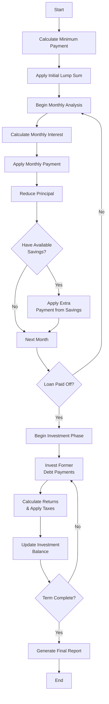

# Debt Payoff vs Investment Calculator

This Streamlit application helps you analyze the trade-off between paying off debt and investing money. It calculates and visualizes how different payment strategies affect your loan balance and potential investment returns over time.

## Features

- Input your loan details including remaining debt, interest rate, and term
- Set up investment parameters including returns and tax considerations
- Compare different payment strategies with lump sum and monthly payments
- Visualize loan balance vs savings over time
- See detailed breakdown of principal and interest payments
- Support for different investment types (CDs vs Stocks) with appropriate tax handling

## Installation

1. Clone this repository
2. Create a virtual environment:
```bash
python -m venv venv
source venv/bin/activate
```

3. Install the required dependencies:
```bash
pip install -r requirements.txt
```

## Usage

Run the Streamlit app:
```bash
streamlit run app.py
```

The application will open in your default web browser. Enter your loan and investment details to see the analysis.

## Input Parameters

### Loan Details
- Remaining debt amount
- Debt interest rate
- Loan term in years
- Target monthly payment (can be more or less than minimum payment)

### Investment Details
- Lump sum payoff amount
- Lump sum payment timing
- Anticipated investment return rate
- Investment type (CD or Stocks)
- Applicable tax rate

## Analysis

The calculator shows:
1. Balance over time for both loan and savings
2. Monthly payment breakdown between principal and interest
3. Summary statistics including total interest paid and final savings balance

## Notes

- All calculations assume monthly compounding
- CD investments are taxed monthly on earned interest
- Stock investments are taxed only when money is withdrawn for loan payments
- The calculator assumes all excess payments (above minimum) go to savings when the loan is paid off 

## How the Calculation Works

The calculator performs a month-by-month analysis of debt payoff with optional investment of savings, following a "debt first" approach. Here's how it works:

### Initial Setup
1. Calculate minimum monthly payment based on loan amount, term, and interest rate
2. Process any initial lump sum payment to reduce principal
3. Determine monthly payment capacity (can be above minimum payment)
4. Set up tracking for any existing savings that could be used for debt

### Monthly Analysis Loop
For each month until the loan is paid off:

1. Calculate interest for the month based on current balance
2. Apply the desired target monthly payment as part of the monthly payment
   - First portion covers interest
   - Remainder reduces principal
3. If savings are available and configured to be used:
   - Apply additional payment from savings
   - Reduce available savings accordingly (after accounting for withdrawal tax, if applicable)
4. Apply any remaining minimum payment as part of the monthly payment
5. Track:
   - Remaining loan balance
   - Total interest paid
   - Total principal paid
   - Total savings contributions
   - Total pocket money (difference between target and minimum payments)
   - Remaining savings (if any)

### Post-Debt-Payoff Phase
Once the loan is paid off:
1. Redirect former debt payments to investments, up to the target monthly payment
2. Calculate investment returns (compounded monthly)
3. Apply appropriate taxes based on investment type:
   - CDs: Monthly tax on interest earned
   - Stocks: Tax only on withdrawals

### Final Analysis
- Total time to debt freedom
- Total interest paid on loan
- Final investment balance
- Net worth impact



## Code Structure

### Monthly Analysis Function

The core calculation is encapsulated in a pure function that processes a single month:

```python
def process_month(
    # Configuration (immutable)
    config: PaymentConfig,
    derived: DerivedConfig,
    
    # Current state (input)
    loan_state: LoanState,
    savings_state: SavingsState,
) -> MonthlyResult:
    """Process a single month of loan payments and savings.
    
    Args:
        config: User-provided configuration including rates and preferences
        derived: Pre-calculated values like minimum payments
        loan_state: Current loan balance and payment history
        savings_state: Current savings balance and history
        
    Returns:
        MonthlyResult containing:
        - New loan state
        - New savings state
        - Interest paid this month
        - Principal paid this month
        - Investment returns this month
        - Taxes paid this month
    """
```

#### Data Classes
```python
@dataclass
class PaymentConfig:
    loan_amount: float
    loan_rate: float
    loan_term_months: int
    target_payment: float
    investment_rate: float
    tax_rate: float
    investment_type: str  # 'CD' or 'STOCK'
    use_savings_for_debt: bool

@dataclass
class DerivedConfig:
    minimum_payment: float
    
@dataclass 
class LoanState:
    balance: float
    total_interest_paid: float
    total_principal_paid: float

@dataclass
class SavingsState:
    balance: float
    total_returns: float
    total_taxes_paid: float

@dataclass
class MonthlyResult:
    new_loan_state: LoanState
    new_savings_state: SavingsState
    interest_payment: float
    principal_payment: float
    investment_returns: float
    tax_payment: float
```

This pure functional approach provides several benefits:
1. Easy to test with different scenarios
2. Clear separation between configuration and state
3. Immutable inputs prevent side effects
4. Explicit tracking of all money flows
5. Simple to verify conservation of money
